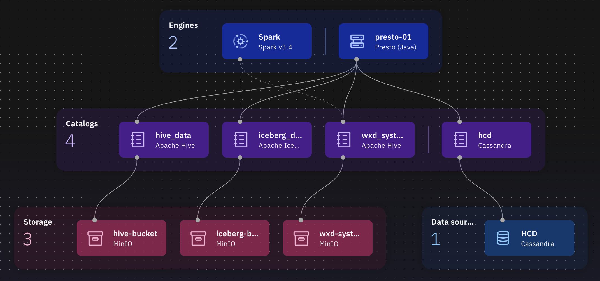
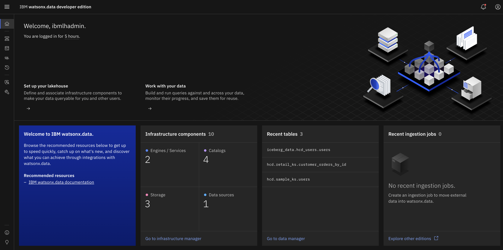
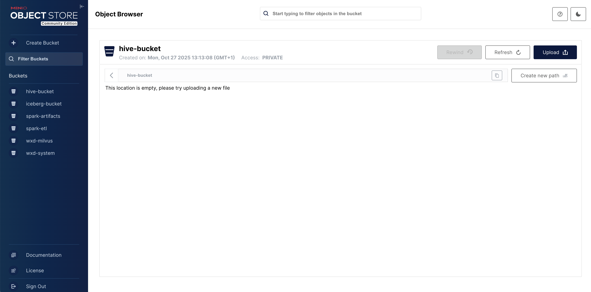
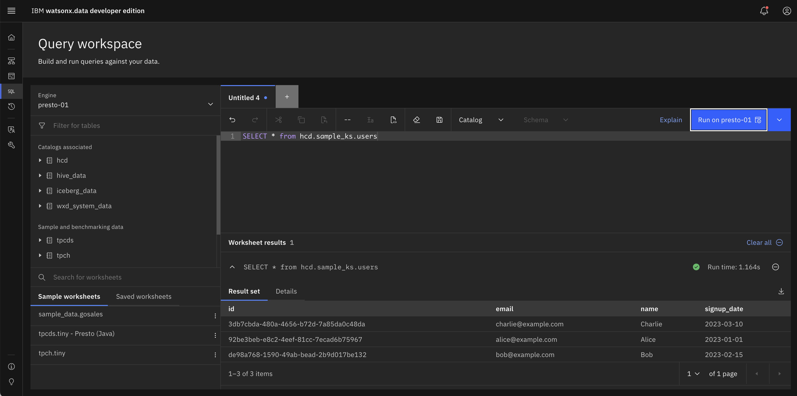
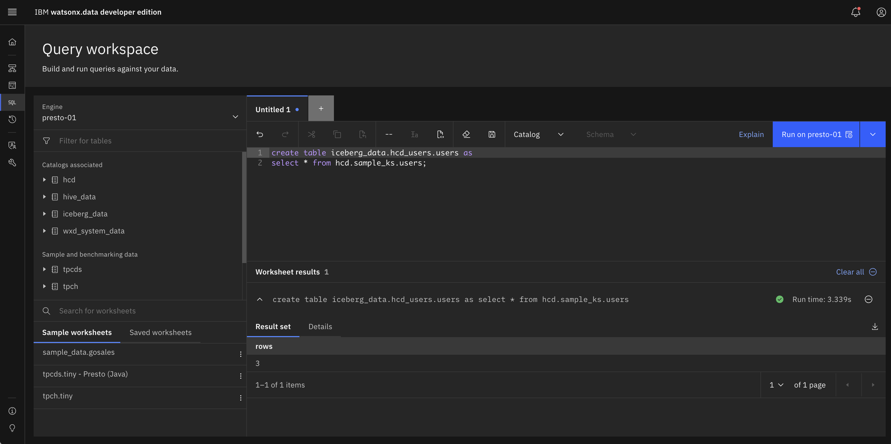
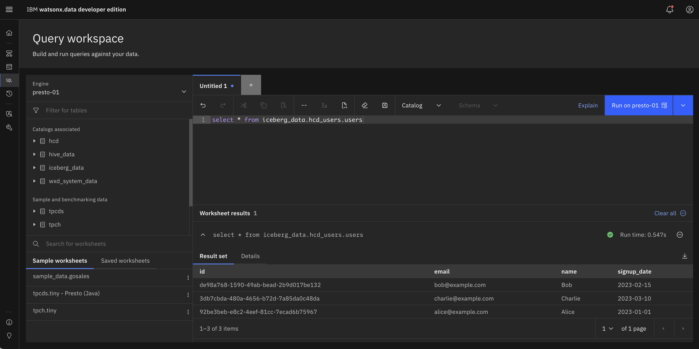
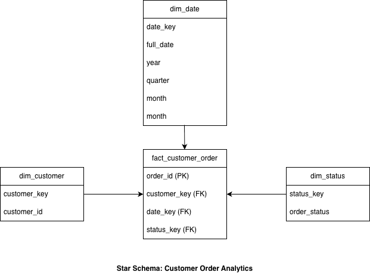

# 🚀 IBM x DataStax for Converged workloads

<div align="center">


*Upgrade from operational Cassandra to AI-ready analytics and governance with watsonx.data*


</div>

---

## 📋 Table of Contents

- [🎯 Overview](#-overview)
- [⚙️ Prerequisites](#️-prerequisites)
- [🔧 Installation Steps](#-installation-steps)
  - [A. IBM watsonx.data Developer Edition](#a-ibm-watsonxdata-developer-edition)
  - [B. DataStax Hyper-Converged Database](#b-datastax-hyper-converged-database)
  - [C. Add HCD to watsonx.data](#c-add-hcd-to-watsonxdata)
- [🔍 Federated Analytics](#-federated-analytics)
- [📊 Materialized Analytics using wx.d CTAS](#-materialized-analytics-using-wxd-ctas)
- [⚡ Utilizing the Spark Engine](#-utilizing-the-spark-engine-for-materialized-analytics)
- [📚 References](#-references)
- [🛠️ Troubleshooting](#️-troubleshooting)

---

## 🎯 Overview

<div align="center">



</div>

### 🎯 Purpose
Facilitate seamless integration of **DataStax HCD (Cassandra)** to manage extensive operational workloads, using **IBM watsonx.data** for enhanced governed analytics capabilities.

### 📖 Scope
This guide covers:
- ✅ Installation of IBM watsonx.data Developer Edition
- ✅ Setup of DataStax Hyper-Converged Database (HCD)
- ✅ Integration between operational and analytical systems
- ✅ Real-time data synchronization using Apache Spark
- ✅ Materialized analytics with Apache Iceberg tables

### 👥 Target Audience
- 🧑‍💻 **Developers** - Implementation and integration
- 🔧 **Customer Engineers** - Solution deployment
- 💼 **Pre-sales Professionals** - Solution demonstration

## ⚙️ Prerequisites

### 💻 System Requirements

| Component | Minimum | Recommended |
|-----------|---------|-------------|
| **Architecture** | x86_64 or ARM64 | x86_64 or ARM64 |
| **CPU Cores** | 10 cores | 16 cores |
| **Memory** | 16GB RAM | 24GB RAM |
| **Disk Space** | 150GB free | 200GB+ free |

### 🖥️ Supported Platforms
- 🍎 **macOS** (Intel or Apple Silicon)
- 🪟 **Windows 10/11** 64-bit
- 🐧 **Linux** (Ubuntu 20.04+, RHEL 8+)

### 📦 Required Software
- **Docker/Podman** - Container runtime
- **Kubernetes** - Container orchestration
- **Java 11 or 17** - For DataStax HCD
- **Maven** - For building Java applications

---

## 🔧 Installation Steps

### A. IBM watsonx.data Developer Edition

> ⏱️ **Installation Time**: The setup process may take 15-30 minutes depending on your system performance.

1. **📥 Download & Install**  
   Follow the [IBM watsonx.data Developer Edition installation steps](https://www.ibm.com/docs/en/watsonxdata/standard/2.2.x?topic=developer-edition-new-version).

2. **🔍 Verify Installation**  
   Check that all pods are running correctly:
   ```bash
   kubectl get pods -n wxd
   kubectl get pods -n wxd | wc -l # should return 22
   ```

3. **🌐 Expose the UI**
   ```bash
   export KUBECONFIG=~/.kube/config && nohup kubectl port-forward -n wxd service/lhconsole-ui-svc 6443:443 --address 0.0.0.0 > /dev/null 2>&1 &
   ```

4. **✅ Test Access**  
   Navigate to [https://localhost:6443/](https://localhost:6443/) and log in with:
   - **Username**: `ibmlhadmin`
   - **Password**: `password`

   <div align="center">
   
   
   
   </div>

5. **🔧 Optional: Access MinIO and MDS**
   ```bash
   # MinIO (Object Storage)
   export KUBECONFIG=~/.kube/config && nohup kubectl port-forward -n wxd service/ibm-lh-minio-svc 9001:9001 --address 0.0.0.0 > /dev/null 2>&1 &
   
   # MDS (Metadata Service)
   export KUBECONFIG=~/.kube/config && nohup kubectl port-forward -n wxd service/ibm-lh-mds-thrift-svc 8381:8381 --address 0.0.0.0 > /dev/null 2>&1 &
   ```

   > 📖 **Reference**: See the [IBM watsonx.data documentation](https://www.ibm.com/docs/en/watsonxdata/standard/2.2.x?topic=administering-exposing-minio-service) for more information.

   Access MinIO at [http://localhost:9001/](http://localhost:9001/) with credentials:
   - **Username**: `dummyvalue`
   - **Password**: `dummyvalue`

   <div align="center">
   
   
   
   </div>

### B. DataStax Hyper-Converged Database

1. **📥 Download & Extract**
   ```bash
   # Download the HCD tarball
   wget http://downloads.datastax.com/hcd/hcd-1.2.3-bin.tar.gz
   
   # Extract the archive
   tar -xzf hcd-1.2.3-bin.tar.gz
   ```

2. **Create the logging directory**
   ```bash
   sudo mkdir /var/log/cassandra
   sudo chown $(whoami):$(id -gn) /var/log/cassandra
   ```

3. **☕ Configure Java Environment**
   ```bash
   # Set Java 17 environment (required for HCD)
   export JAVA_HOME="$(/usr/libexec/java_home -v17)"
   export PATH="$JAVA_HOME/bin:$PATH"
   export CASSANDRA_JDK_UNSUPPORTED=true
   ```

4. **🚀 Start HCD**
   ```bash
   ./hcd-1.2.3/bin/hcd cassandra
   ```

   > ✅ **Success Indicator**: Look for this message in the logs:
   > ```
   > INFO  [main] 2025-10-27 13:40:24,500 HcdDaemon.java:22 - HCD startup complete
   > ```

5. **🔍 Test Connection**
   ```bash
   ./hcd-1.2.3/bin/cqlsh -u cassandra -p cassandra
   ```
   ⚠️ This step depends on Python to be installed.
   
   Type `quit` to exit the CQL shell.

5. **📊 Load Sample Data**
   ```bash
   cqlsh -f sample-data.cql
   ```
   
> 🎉 **Success!** You have successfully installed HCD and loaded some sample data!

### C. Add HCD to watsonx.data

1. **🔗 Connect HCD to watsonx.data**
   - Navigate to [https://localhost:6443/#/infrastructure-manager](https://localhost:6443/#/infrastructure-manager)
   - Click `Add component`
   - Select `Cassandra` as a data source
   - Click `Next`

2. **⚙️ Configuration Details**  
   Use the following configuration details:

   | Field | Value |
   |-------|-------|
   | **Display name** | `HCD` |
   | **Hostname** | `host.containers.internal` |
   | **Port** | `9042` |
   | **Username** | `cassandra` |
   | **Password** | `cassandra` |
   | **Associate catalog** | ✅ Checked |
   | **Catalog name** | `hcd` |

   Click `Create`.

3. **✅ Verify Data Access**
   - Click the `hcd` catalog
   - Click `Data Objects`
   - Expand `sample_ks` and click `users`
   - Click `Data sample` and confirm the 3 users are present

   <div align="center">
   
   
   
   </div>

> 🎉 **Success!** You have successfully configured watsonx.data to access HCD!

---

## 🔍 Federated Analytics

> 🎯 **Goal**: Query operational Cassandra data directly using SQL through Presto query engine

The first converged data integration leverages **federated analytics** using Presto as the query engine, allowing you to query Cassandra data using standard SQL without data movement.

### 📋 Steps

1. **🔗 Associate HCD Catalog with Presto**
   - Click `Presto` in the Infrastructure Manager
   - Click `Manage associations`
   - Add `hcd` catalog
   - Click `Save and restart engine`

2. **🔍 Query Operational Data**
   - Open `Query workspace` from the left sidebar
   - Ensure `Presto` is selected as the active engine
   - Run the following query:
   ```sql
   SELECT * FROM hcd.sample_ks.users;
   ```

   <div align="center">
   
   
   
   </div>

> 🎉 **Success!** You have successfully queried Cassandra data using SQL through the Presto Query Engine!

---

## 📊 Materialized Analytics using wx.d CTAS

> 🎯 **Goal**: Create materialized views for better performance and reduced operational system load

Federated analytics can be stressful on operational systems handling massive workloads with low latency requirements. **Data Offloading** addresses this by materializing data into a governed catalog with associated Parquet files. Watsonx.data facilitates this process through `CREATE TABLE AS SELECT`.

### 💡 Benefits of Data Offloading
- 🚀 **Reduced Operational Load** - Minimizes impact on production Cassandra clusters
- 💰 **Cost Optimization** - Offload workloads from expensive data warehouses
- ⚡ **Better Performance** - Faster queries on materialized data
- 🔄 **Flexible Analytics** - Combine offloaded data with warehouse data

### 📋 Implementation Steps

1. **🗂️ Create Iceberg Schema**
   - Click `Data manager` → `Create` → `Create schema`
   - Select:
     - **Catalog**: `iceberg_data`
     - **Name**: `hcd_users`
   - Click `Create`

2. **📦 Transfer Data with CTAS**
   - Click `Query workspace` → `+` (new query tab)
   - Execute the following CTAS (Create Table As Select) query:
   ```sql
   CREATE TABLE iceberg_data.hcd_users.users AS
   SELECT * FROM hcd.sample_ks.users;
   ```

   <div align="center">
   
   
   
   </div>

3. **✅ Verify Materialized Data**
   - Click `Query workspace` → `+` (new query tab)
   - Run the following query on the analytical catalog:
   ```sql
   SELECT * FROM iceberg_data.hcd_users.users;
   ```

   <div align="center">
   
   
   
   </div>

> 🎉 **Success!** You have successfully queried the newly created catalog, offloading query workload from the operational HCD database!

---

## ⚡ Utilizing the Spark Engine for Materialized Analytics

> 🎯 **Goal**: Leverage Apache Spark for advanced data processing and analytics workloads

Many DataStax DSE customers require Spark capabilities for operational data analytics. With watsonx.data, you can achieve seamless synergy between operational and analytical processing using the Hyper-Converged Database (HCD).

This section uses the [cass_spark_iceberg repository](https://github.ibm.com/pravin-bhat/cass_spark_iceberg) that:
1. Pulls the operation data from HCD
2. Turns it into analytical data using a Star-schema and stores in Iceberg tables
3. Runs several analytical queries on the Iceberg tables, offloading workload from HCD

<div align="center">



</div>

💡 For more information about the process, sequence, tables and see [OLAP-STAR-SCHEMA.md](./OLAP-STAR-SCHEMA.md).

### 📋 Implementation Steps

1. **🔧 Create Spark Engine**
   - Click `Infrastructure manager`
   - Select `IBM Spark` → `Next`
   - Configure:
     - **Display name**: `Spark`
     - **Associated catalogs**: `iceberg_data`
   - Click `Create`

2. **📥 Clone and Build Sample Application**  
   This step depends on the contactpoint for Cassandra to be set correctly in `.../utils/CassUtil.java` on line 17.

   In order to find your configured datacenter name, check the Cassandra config or run:
   ```bash
   ./hcd-1.2.3/bin/nodetool status | grep Datacenter
   ```
   
   Update `CassUtil.java` accordingly and build the app:
   ```bash
   # Clone the example repository
   git clone https://github.ibm.com/pravin-bhat/cass_spark_iceberg
   cd cass_spark_iceberg
   
   # Update Cassandra connection settings in CassUtil.java
   # Build the application
   mvn clean package
   ```

3. **📊 Generate Sample Data**

   ⚠️ For this step to work correctly the correct keyspace and table have to be created. Please refer to [Troubleshooting](#️-troubleshooting) to create these tables in case the Java application does not create them.

   ```bash
   mvn exec:java -Dexec.mainClass="com.ibm.wxd.datalabs.demo.cass_spark_iceberg.LoadCustomerOrdersById"
   ```

   > 🔍 **Verify Data**: Check data creation in watsonx.data Query workspace or via CQL:
   > ```bash
   > ./hcd-1.2.3/bin/cqlsh
   > ```
   > and run the following query:
   > ```sql
   > SELECT * FROM retail_ks.customer_orders_by_id;
   > ```

4. **🪣 Prepare MinIO S3 Buckets**
   - Ensure MinIO service is port-forwarded (see [Section A](#a-ibm-watsonxdata-developer-edition))
   - Create buckets: `olap` and `spark-artifacts`
   - Upload JAR file: `cass-spark-iceberg-1.2.jar` → `spark-artifacts` bucket

5. **📊 Monitor Execution**
   - Execute logs watcher: `./spark-logs.sh`
   - Click `Submit application`
   - Kick off the next step and watch results in the logs watcher terminal 🎉

6. **🚀 Run OLAP Job**
   - Navigate to `wx.d Infrastructure manager` → Click `Spark` engine
   - Click `Applications` → `Create application +`
   - Click `Payload` and paste the configuration:

   ```json
   {
       "application_details": {
           "application": "s3a://spark-artifacts/cass-spark-iceberg-1.2.jar",
           "class": "com.ibm.wxd.datalabs.demo.cass_spark_iceberg.CassandraToIceberg",
           "conf": {
               "spark.cassandra.connection.host": "host.containers.internal",
               "spark.cassandra.auth.username": "cassandra",
               "spark.cassandra.auth.password": "cassandra",
               "spark.sql.catalog.spark_catalog.warehouse": "s3a://olap/",
               "spark.hadoop.fs.s3a.impl": "org.apache.hadoop.fs.s3a.S3AFileSystem",
               "spark.hadoop.fs.s3a.path.style.access": "true",
               "spark.hadoop.fs.s3a.bucket.spark-artifacts.endpoint": "http://ibm-lh-minio-svc:9000",
               "spark.hadoop.fs.s3a.bucket.spark-artifacts.access.key": "dummyvalue",
               "spark.hadoop.fs.s3a.bucket.spark-artifacts.secret.key": "dummyvalue",
               "spark.hadoop.fs.s3a.bucket.spark-artifacts.aws.credentials.provider": "org.apache.hadoop.fs.s3a.SimpleAWSCredentialsProvider",
               "spark.hadoop.fs.s3a.bucket.olap.endpoint": "http://ibm-lh-minio-svc:9000",
               "spark.hadoop.fs.s3a.bucket.olap.access.key": "dummyvalue",
               "spark.hadoop.fs.s3a.bucket.olap.secret.key": "dummyvalue",
               "spark.hadoop.fs.s3a.bucket.olap.aws.credentials.provider": "org.apache.hadoop.fs.s3a.SimpleAWSCredentialsProvider"
           }
       },
       "deploy_mode": "local"
   }
   ```

   Now click `Submit application` and watch the logging window for output.

---

## 📚 References

| Resource | Description | Link |
|----------|-------------|------|
| **IBM watsonx.data Documentation** | Official installation guide | [Developer Edition Setup](https://www.ibm.com/docs/en/watsonxdata/standard/2.2.x?topic=developer-edition-new-version) |
| **DataStax HCD Integration** | GitHub repository with integration examples | [wx.d-developers-edition-add-hcd](https://github.ibm.com/Data-Labs/wx.d-developers-edition-add-hcd) |
| **Spark Iceberg Example** | Sample application by Pravin Bhat | [cass_spark_iceberg](https://github.ibm.com/pravin-bhat/cass_spark_iceberg) |
| **macOS Container GPU** | Technical article on enabling containers GPU on macOS | [Enabling Containers GPU macOS](https://sinrega.org/2024-03-06-enabling-containers-gpu-macos) |

---

## 🛠️ Troubleshooting

### 🍎 Podman on Apple Silicon

> ⚠️ **Issue**: LibKrun limitation on Apple Silicon machines

**Problem**: LibKrun (used by Podman Desktop on Apple Silicon) is limited to 8 cores, but watsonx.data Developer Edition requires at least 10 cores.

#### ✅ Solution: Switch to applehv

```bash
podman machine stop
export CONTAINERS_MACHINE_PROVIDER=applehv
podman machine init --cpus 10 --memory 16384 --rootful podman-wxd
podman machine start podman-wxd
```

#### 📊 Comparison: applehv vs libkrun

| Feature | applehv | libkrun |
|---------|---------|---------|
| **CPU Limit** | ✅ Flexible (10+ cores) | ❌ Hard-coded 8 cores |
| **Stability** | ✅ Native macOS support | ⚠️ Limited support |
| **GPU Passthrough** | ❌ Not available | ✅ Supported |
| **Isolation** | ⚠️ Basic | ✅ Advanced |
| **Customization** | ⚠️ Limited | ✅ Extensive |

### 💾 Memory Optimization

> ⚠️ **Issue**: Default machine configuration may cause high memory utilization

**Problem**: Default `podman-wxd` machine (10 cores, 16GB RAM) often reaches 98% memory utilization.

#### ✅ Solution: Pre-create Optimized Machine

```bash
podman machine stop
export CONTAINERS_MACHINE_PROVIDER=applehv
podman machine init --cpus 12 --memory 24576 --rootful podman-wxd
podman machine start podman-wxd
```

### 🔧 Spark OLAP Missing Keyspace

> ⚠️ **Issue**: Sample data generation fails due to missing keyspace/table

**Problem**: The `LoadCustomerOrdersById` step fails when keyspace and table don't exist.

#### ✅ Solution: Create Required Schema

```sql
-- Connect to CQL shell
./hcd-1.2.3/bin/cqlsh

-- Create keyspace and table
CREATE KEYSPACE retail_ks WITH replication = {'class': 'SimpleStrategy', 'replication_factor': 1};
CREATE TABLE IF NOT EXISTS customer_orders_by_id (
    customer_id uuid, 
    order_id uuid, 
    order_date timestamp, 
    status text, 
    PRIMARY KEY (customer_id, order_id)
);
```

### Which PODS should be running exactly?

A healthy installation of wx.d developer edition should have 22 pods running.

```bash
kubectl -n wxd get pods
```

Will show the following pods:

```
generate-certs-and-truststore-fhpns               0/1     Completed   0          3d3h
ibm-lh-control-plane-prereq-p6fl9                 0/1     Completed   0          3d3h
ibm-lh-mds-rest-7f6d55c7f4-ql6h5                  1/1     Running     0          3d3h
ibm-lh-mds-thrift-6794898844-xgxl7                1/1     Running     0          3d3h
ibm-lh-minio-5fb9dffc57-mdqg8                     1/1     Running     0          3d3h
ibm-lh-presto-5b66899b8c-94kwp                    1/1     Running     0          3d3h
ibm-lh-validator-bc7dcccbb-6d9d9                  1/1     Running     0          3d3h
image-pull-job-h2vhc                              0/1     Completed   0          3d3h
lhams-api-7bb48b798-xnmds                         1/1     Running     0          3d3h
lhconsole-api-6f6cb9f7b8-zffsx                    1/1     Running     0          3d3h
lhconsole-nodeclient-666fb7f79d-p2m84             1/1     Running     0          3d3h
lhconsole-ui-645dc7d649-n7j2x                     1/1     Running     0          3d3h
lhingestion-api-7bdbd8b786-wd24f                  1/1     Running     0          3d3h
spark-hb-control-plane-66547699c-jxbdg            2/2     Running     0          3d3h
spark-hb-create-trust-store-758c8848c8-hw4sr      1/1     Running     0          3d3h
spark-hb-deployer-agent-5dd65b47c6-bp8dk          2/2     Running     0          3d3h
spark-hb-load-postgres-db-specs-44l4v             0/1     Completed   0          3d3h
spark-hb-nginx-68944fd748-mhnng                   1/1     Running     0          3d3h
spark-hb-register-hb-dataplane-6f9549976f-vg7lb   1/1     Running     0          3d2h
spark-hb-ui-595c9588c8-j7m9z                      1/1     Running     0          3d3h
wxd-pg-postgres-0                                 1/1     Running     0          3d3h
```

---

<div align="center">

*For additional support, please refer to the official documentation or contact your IBM representative.*

</div>

/v1