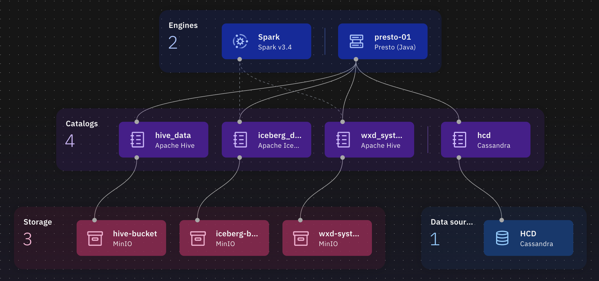
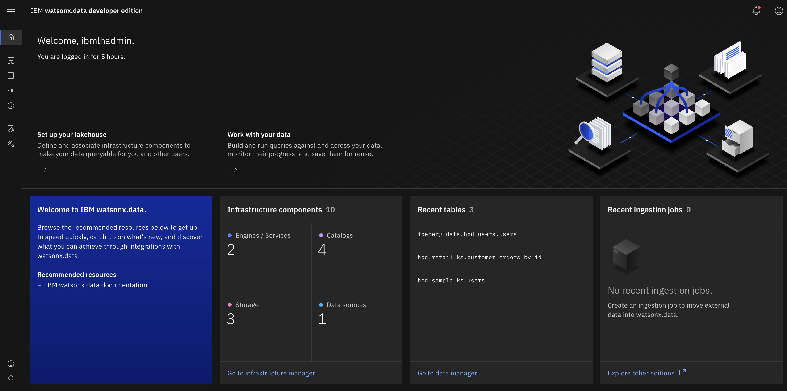
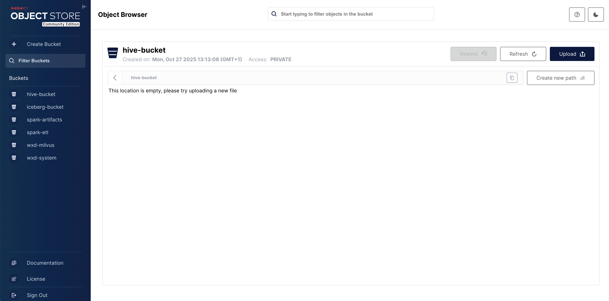
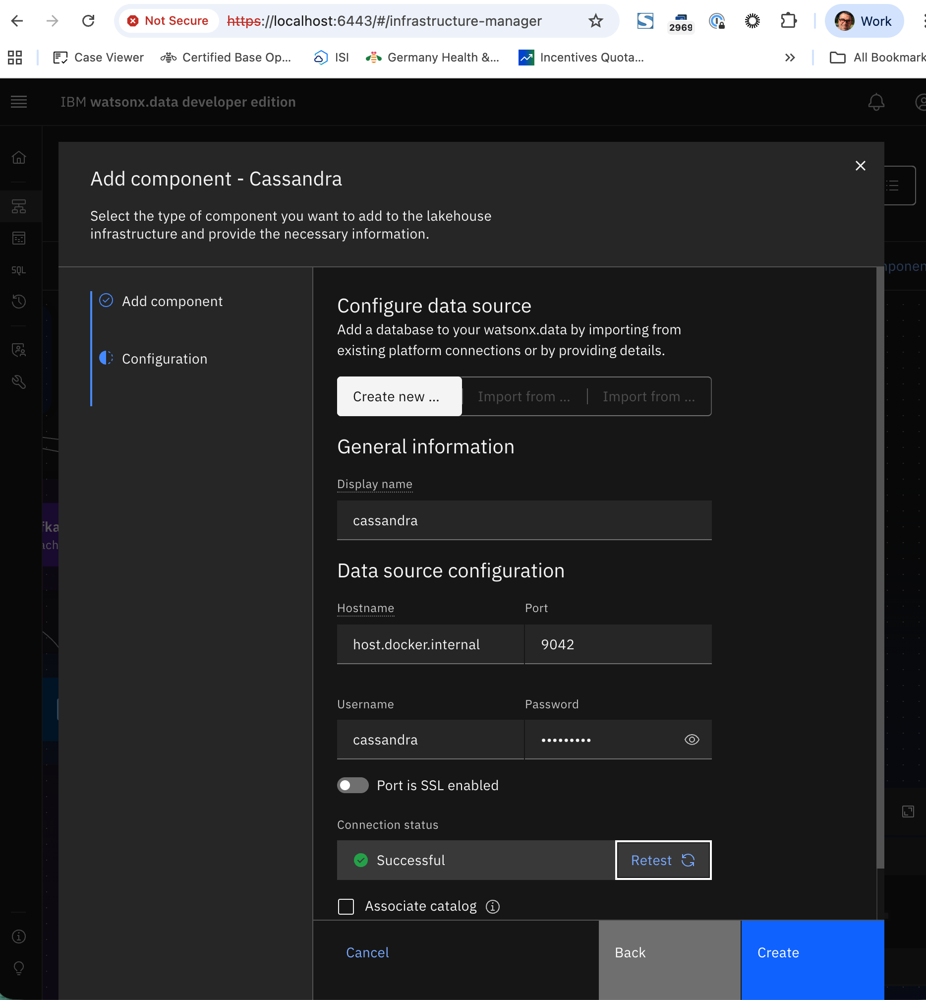
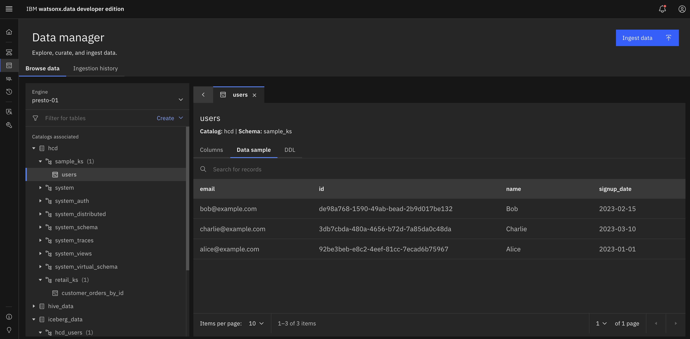
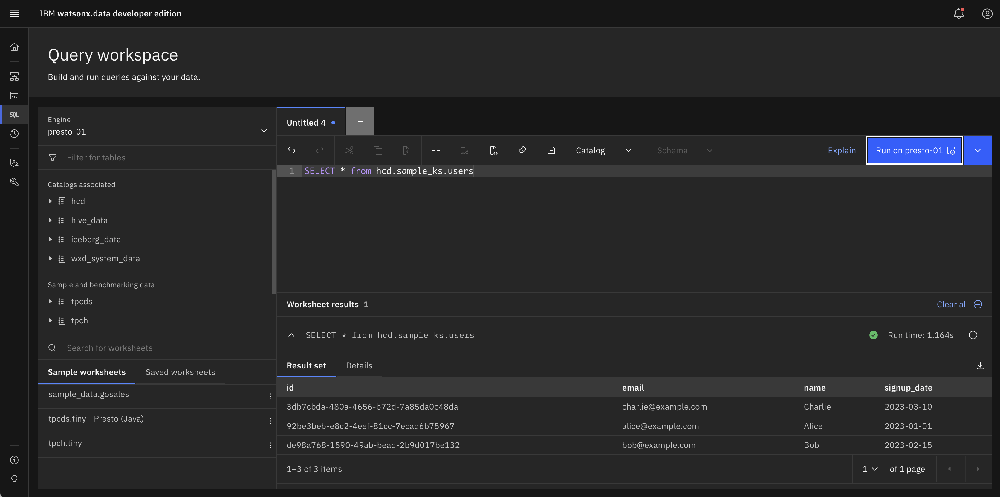
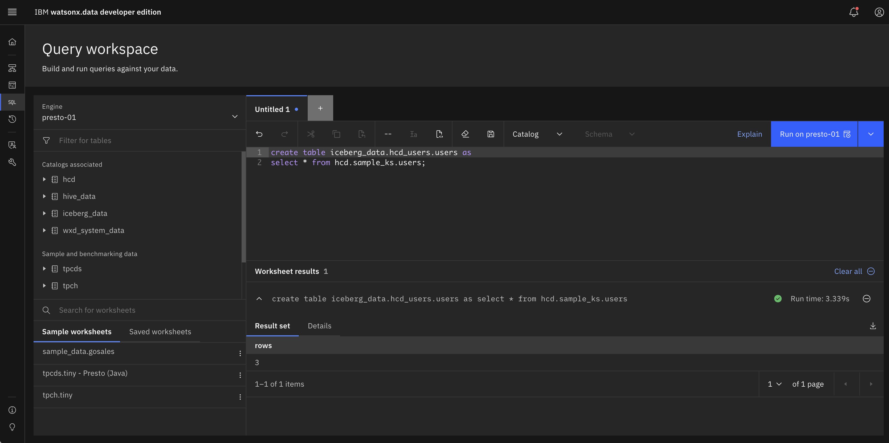
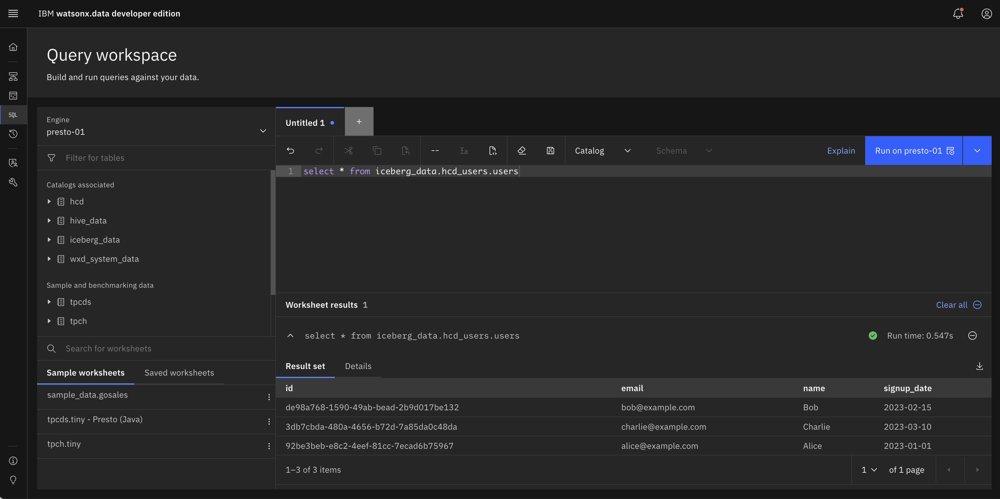
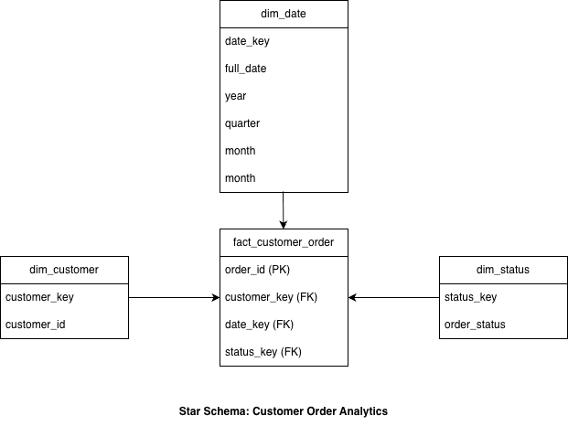

# 🚀 IBM x DataStax for Converged workloads

<div align="center">


*Upgrade from operational Cassandra to AI-ready analytics and governance with watsonx.data*


</div>

---

## 📋 Table of Contents

- [🎯 Overview](#overview)
  - [What you'll learn](#what-youll-learn)
- [⚙️ Prerequisites](#prerequisites)
- [🔧 Installation Steps](#installation-steps)
  - [A. Container runtime](#a-container-runtime)
  - [B. IBM watsonx.data Developer Edition](#b-ibm-watsonxdata-developer-edition)
  - [C. DataStax Hyper-Converged Database](#c-datastax-hyper-converged-database)
  - [C. Add HCD (here substituted by Cassandra) to watsonx.data](#c-add-hcd-here-substituted-by-cassandra-to-watsonxdata)
- [🔍 Federated Analytics](#federated-analytics)
- [📊 Materialized Analytics using wx.d CTAS](#materialized-analytics-using-wxd-ctas)
- [⚡ Utilizing the Spark Engine for Materialized Analytics](#utilizing-the-spark-engine-for-materialized-analytics)
- [📈 Running OLAP queries on watsonx.data](#running-olap-queries-on-watsonxdata)
- [🧹 Pause, restart, and cleanup](#pause-restart-and-cleanup)
  - [Pause and restart](#pause-and-restart)
  - [Cleanup (tear down)](#cleanup-tear-down)
- [📚 References](#references)

---

<a id="overview"></a>
## 🎯 Overview

<div align="center">



</div>

### 🎯 Purpose
Facilitate seamless integration of **DataStax HCD (Cassandra)** to manage extensive operational workloads, using **IBM watsonx.data** for enhanced governed analytics capabilities.

<a id="what-youll-learn"></a>
### 🎓 What you'll learn
By following this lab end to end, you will learn how to:
- Register a Cassandra-compatible operational tier in watsonx.data (using **Apache Cassandra 5** on **Kind**—the same catalog and connectivity pattern you use with **DataStax HCD** in production).
- Run **federated SQL** over live operational data through Presto without copying it first.
- **Offload** heavy analytics with **CTAS** into an Iceberg-backed catalog (materialized Parquet) to protect operational SLAs.
- Submit a **Spark** application that builds a **star schema**, writes **Iceberg** tables to **MinIO** (S3-compatible storage), and **verify** the resulting objects in the bucket.
- Associate that object storage with a **Hive** catalog, expose it to **Presto**, and query the **Parquet** layout with **OLAP-style SQL** (including external tables / zero-copy style access to files already in the lake).

### 📖 Scope
**In scope for this repository**
- Installing and reaching **IBM watsonx.data Developer Edition** (UI, optional MinIO console port-forward).
- Running **Apache Cassandra 5** on **Kind** ([`cassandra.yaml`](./cassandra.yaml)), loading sample schema/data, and registering it as the **`hcd`** catalog.
- **Federated** queries in Presto, **CTAS** materialization into Iceberg, and a **batch ETL** Spark job (Cassandra → star schema → Iceberg on MinIO—not continuous or low-latency replication).
- Wiring **MinIO** into watsonx.data, registering external **Parquet** locations, and running example **analytics** queries in the Query workspace.

**Out of scope**
- Sizing, hardening, or operating a production **DataStax HCD** cluster; multi-datacenter replication; security beyond lab defaults.
- **Streaming** or **CDC**-style change capture; this lab uses on-demand Spark runs and SQL-driven materialization instead.
- Product licensing, billing, or IBM Cloud SaaS-specific deployment—the steps target **Developer Edition** on your machine.

### 👥 Target Audience
- 🧑‍💻 **Developers** - Implementation and integration
- 🔧 **Customer Engineers** - Solution deployment
- 💼 **Pre-sales Professionals** - Solution demonstration

<a id="prerequisites"></a>
## ⚙️ Prerequisites

### 💻 System Requirements

| Component | Minimum | Recommended |
|-----------|---------|-------------|
| **Architecture** | x86_64 or ARM64 | x86_64 or ARM64 |
| **CPU Cores** | 10 cores | 16 cores |
| **Memory** | 16GB RAM | 24GB RAM |
| **Disk Space** | 150GB free | 200GB+ free |

### 🖥️ Supported Platforms
- 🍎 **macOS** (Intel or Apple Silicon)
- 🪟 **Windows 10/11** 64-bit
- 🐧 **Linux** (Ubuntu 20.04+, RHEL 8+, Fedora 43+)

### 📦 Required Software
- **Docker/Podman** - Container runtime
- **Kubernetes** - Container orchestration
- **Helm** - Kubernetes package manager (required to install/upgrade watsonx.data and dependencies)
- **Java 11 or 17** - For building and running the sample Spark/Cassandra Java project (`mvn`)
- **Maven** - For building Java applications

---

<a id="installation-steps"></a>
## 🔧 Installation Steps

<a id="a-container-runtime"></a>
### A. Container runtime

Ensure you have your runtime of choice set up. Refer to [Container Fundamentals](https://github.com/michelderu/container-fundamentals) and the specific setup instructions for your architecture [here](https://github.com/michelderu/container-fundamentals/blob/main/course/08-setup-linux-macos-windows.md).

<a id="b-ibm-watsonxdata-developer-edition"></a>
### B. IBM watsonx.data Developer Edition

> ⏱️ **Installation Time**: The setup process may take 15-30 minutes depending on your system performance.

1. **📥 Download & Install**  
   Follow the [IBM watsonx.data Developer Edition installation steps](https://www.ibm.com/docs/en/watsonxdata/standard/2.3.x?topic=developer-edition-new-version).  
   
> [!NOTE]  
> Alternatively you can follow the manual installation instructions [here](./wxd-manual-install.md).

2. **🔍 Verify Installation**  
   Watch pods initializing:
   ```bash
   watch kubectl get pods -n wxd
   ```

   After a few minutes to tens of minutes (depending on your system), you should see a similar status:

   ```text
   NAME                                              READY   STATUS      RESTARTS   AGE
   generate-certs-and-truststore-lwmm6               0/1     Completed   0          11m
   ibm-lh-control-plane-prereq-45hl9                 0/1     Completed   0          10m
   ibm-lh-mds-rest-7cc9bd5c9b-px5xw                  1/1     Running     0          8m52s
   ibm-lh-mds-thrift-679698fd56-22ldx                1/1     Running     0          8m52s
   ibm-lh-minio-7b6dfc69f8-88xgh                     1/1     Running     0          8m52s
   ibm-lh-presto-5d8bfdbd77-892cw                    1/1     Running     0          8m52s
   ibm-lh-validator-7877c94d95-j47qx                 1/1     Running     0          8m52s
   image-pull-job-wzxfv                              0/1     Completed   0          8m51s
   lhams-api-64874857bc-wndfz                        1/1     Running     0          8m53s
   lhconsole-api-6767df9d79-xjxq4                    1/1     Running     0          8m53s
   lhconsole-nodeclient-84fbc5b998-kb4pj             1/1     Running     0          8m53s
   lhconsole-ui-79bd784dc9-zxmz2                     1/1     Running     0          8m52s
   lhingestion-api-846498cb98-ntlm5                  1/1     Running     0          8m52s
   spark-hb-control-plane-975c76d8-qmkd9             2/2     Running     0          8m51s
   spark-hb-create-trust-store-9d577b768-2gsds       1/1     Running     0          9m9s
   spark-hb-deployer-agent-c5444448c-kpzmd           2/2     Running     0          8m51s
   spark-hb-load-postgres-db-specs-vgwrz             0/1     Completed   0          9m9s
   spark-hb-nginx-8647978c8-g69fv                    1/1     Running     0          8m51s
   spark-hb-register-hb-dataplane-6dd49b8f84-v9lbd   1/1     Running     0          5m36s
   spark-hb-ui-c5bb88ccd-vjmhf                       1/1     Running     0          8m51s
   wxd-pg-postgres-0                                 1/1     Running     0          10m
   ```

3. **🌐 Expose the UI**  
   Forwarding on `0.0.0.0` lets other hosts reference your machine IP:

   ```bash
   nohup kubectl port-forward -n wxd service/lhconsole-ui-svc 6443:443 --address 0.0.0.0 2>&1 &
   ```

4. **✅ Test Access**  
   Navigate to [https://localhost:6443/](https://localhost:6443/) (Expect a browser warning for the Development/TLS certificate) and log in with the defaults (unless you changed them):
   - **Username**: `ibmlhadmin`
   - **Password**: `password`

   <div align="center">
   
   
   
   </div>

5. **🔧 Optional: Access MinIO and MDS**
   ```bash
   # MinIO (Object Storage)
   nohup kubectl port-forward -n wxd service/ibm-lh-minio-svc 9001:9001 --address 0.0.0.0 > /dev/null 2>&1 &
   
   # MDS (Metadata Service)
   nohup kubectl port-forward -n wxd service/ibm-lh-mds-thrift-svc 8381:8381 --address 0.0.0.0 > /dev/null 2>&1 &
   ```

   > 📖 **Reference**: See the [IBM watsonx.data documentation](https://www.ibm.com/docs/en/watsonxdata/standard/2.3.x?topic=administering-exposing-minio-service) for more information.

   Access MinIO at [http://localhost:9001/](http://localhost:9001/) with credentials:
   - **Username**: `dummyvalue`
   - **Password**: `dummyvalue`

   <div align="center">
   
   
   
   </div>

<a id="c-datastax-hyper-converged-database"></a>
### C. DataStax Hyper-Converged Database

**DataStax Hyper-Converged Database (HCD)** is DataStax’s Cassandra-compatible platform for large-scale operational workloads. In customer environments the cluster you register in watsonx.data is often HCD (or DSE or Astra). **This lab uses Apache Cassandra 5 on Kubernetes (Kind)** via [`cassandra.yaml`](./cassandra.yaml) in the same cluster as watsonx.data so you can follow the same catalog, federated SQL, Spark, and Iceberg steps without a separate HCD deployment.

1. **☸️ Run Cassandra 5 in Kind**

   Use the **same** Kind cluster where watsonx.data runs, with `kubectl` pointed at that context.

   From the repository root:

   ```bash
   kubectl apply -f cassandra.yaml
   ```

   Wait until the pod is ready (first boot can take a minute or two):

   ```bash
   kubectl wait --for=condition=ready pod/cassandra-0 -n cassandra --timeout=300s
   ```

   Optional — stream logs until you see a startup completion line such as `Startup complete`:

   ```bash
   kubectl logs -f cassandra-0 -n cassandra
   ```

   Press `Ctrl+C` to stop following logs; the pod keeps running.

2. **🔌 Port-forward CQL to your machine**

   For **localhost:9042** (local `cqlsh`, Maven samples that use `localhost` in `CassUtil.java`, or tools on your host), forward the StatefulSet pod:

   ```bash
   nohup kubectl port-forward -n cassandra pod/cassandra-0 9042:9042 --address 0.0.0.0 > /dev/null 2>&1 &
   ```

> [!NOTE]  
> **In-cluster clients** (Presto, Spark on Kubernetes) should use the Kubernetes DNS name below, not the port-forward.

3. **🔍 Test `cqlsh` in the pod**

   ```bash
   kubectl exec -it -n cassandra cassandra-0 -- cqlsh
   ```

   Type `quit` to exit the CQL shell.

4. **📊 Load sample data**

   From the repository root (so `sample-data.cql` resolves correctly):

   ```bash
   kubectl exec -i -n cassandra cassandra-0 -- cqlsh < sample-data.cql
   ```

> 🎉 **Success!** Cassandra is running at **`cassandra.cassandra.svc.cluster.local:9042`** inside the cluster (StatefulSet pod **`cassandra-0`**, namespace **`cassandra`**). The sample schema/data are loaded. Use that hostname in watsonx.data when you register the catalog in the next section. With the port-forward above, you can also use **localhost:9042** from your machine.

<a id="c-add-hcd-here-substituted-by-cassandra-to-watsonxdata"></a>
### C. Add HCD (here substituted by Cassandra) to watsonx.data

1. **🔗 Connect HCD to watsonx.data**
   - Navigate to [Infrastructure Manager](https://localhost:6443/#/infrastructure-manager)
   - Click `Add component`
   - Select `Cassandra` as a data source
   - Click `Next`

2. **⚙️ Configuration Details**  
   Use the following configuration details:

   | Field | Value |
   |-------|-------|
   | **Display name** | `HCD` |
   | **Hostname** | `cassandra.cassandra.svc.cluster.local` |
   | **Port** | `9042` |
   | **Username** | `cassandra` |
   | **Password** | `cassandra` |

   Now first click `Test connection`. Then continue configuration:

   | Field | Value |
   |-------|-------|
   | **Associate catalog** | ✅ Checked |
   | **Catalog name** | `hcd` |

   Click `Create`.

   

3. **🔗 Associate the HCD Catalog with Presto**  
   Within the watsonx.data UI, once your HCD (Cassandra) catalog has been created, you need to associate it with the Presto query engine to enable SQL querying on Cassandra data.

   - Navigate to the Infrastructure Manager by clicking the "Infrastructure Manager" section.
   - Hover over the `hcd` catalog and click on `Manage associations`.
   - Locate your newly created `hcd` catalog and add it to Presto.
   - Select the `presto-01` engine and click `Save and restart Engine`.
   - Once the association is complete and Presto has restarted, your Cassandra data is available as SQL tables in Presto.

4. **✅ Verify Data Access**
   - Navigate to `Data Manager`.
   - Expand the `hcd` catalog and the `sample_ks` keyspace.
   - Click the `users` table.
   - Click `Data sample` and confirm the three users are present.

   <div align="center">
   
   
   
   </div>

> 🎉 **Success!** You have successfully configured watsonx.data to access HCD!

---

<a id="federated-analytics"></a>
## 🔍 Federated Analytics

> 🎯 **Goal**: Query operational Cassandra data directly using SQL through Presto query engine

The first converged data integration leverages **federated analytics** using Presto as the query engine, allowing you to query Cassandra data using standard SQL without data movement.

### 📋 Steps

1. **🔍 Query Operational Data**
   - Open `Query workspace` from the left sidebar
   - Run the following query, while ensuring `Presto` is selected as the active engine:
   ```sql
   SELECT * FROM hcd.sample_ks.users;
   ```

   <div align="center">
   
   
   
   </div>

> 🎉 **Success!** You have successfully queried Cassandra data using SQL through the Presto Query Engine!

---

<a id="materialized-analytics-using-wxd-ctas"></a>
## 📊 Materialized Analytics using wx.d CTAS

> 🎯 **Goal**: Create materialized views for better performance and reduced operational system load

Federated analytics can be stressful on operational systems handling massive workloads with low latency requirements. **Data Offloading** addresses this by materializing data into a governed catalog with associated Parquet files. Watsonx.data facilitates this process through `CREATE TABLE AS SELECT`.

### 💡 Benefits of Data Offloading
- 🚀 **Reduced Operational Load** - Minimizes impact on production Cassandra clusters
- 💰 **Cost Optimization** - Offload workloads from expensive data warehouses
- ⚡ **Better Performance** - Faster queries on materialized data
- 🔄 **Flexible Analytics** - Combine offloaded data with warehouse data

### 📋 Implementation Steps

1. **🗂️ Create Iceberg Schema**
   - Click `Data manager` → `Create` → `Create schema`
   - Select:
     - **Catalog**: `iceberg_data`
     - **Name**: `hcd_users`
   - Click `Create`

2. **📦 Transfer Data with CTAS**
   - Click `Query workspace` → `+` (new query tab)
   - Execute the following CTAS (Create Table As Select) query:
   ```sql
   CREATE TABLE iceberg_data.hcd_users.users AS
   SELECT * FROM hcd.sample_ks.users;
   ```

   <div align="center">
   
   
   
   </div>

3. **✅ Verify Materialized Data**
   - Click `Query workspace` → `+` (new query tab)
   - Run the following query on the analytical catalog:
   ```sql
   SELECT * FROM iceberg_data.hcd_users.users;
   ```

   <div align="center">
   
   
   
   </div>

> 🎉 **Success!** You have successfully queried the newly created catalog, offloading query workload from the operational Cassandra tier—the same integration pattern customers use with **DataStax HCD**.

---

<a id="utilizing-the-spark-engine-for-materialized-analytics"></a>
## ⚡ Utilizing the Spark Engine for Materialized Analytics

> 🎯 **Goal**: Leverage Apache Spark for advanced data processing and analytics workloads

Many DataStax DSE customers require Spark capabilities for operational data analytics. With watsonx.data, you can achieve seamless synergy between operational and analytical processing using the Hyper-Converged Database (HCD).

This section uses the [cass_spark_iceberg repository](https://github.ibm.com/pravin-bhat/cass_spark_iceberg) that:
1. Pulls operational data from your Cassandra-compatible cluster (the lab registers it as the `hcd` catalog; production is often **DataStax HCD**)
2. Turns it into analytical data using a star schema and stores it in Iceberg tables
3. Runs several analytical queries on the Iceberg tables, offloading workload from the operational tier

<div align="center">



</div>

💡 For more information about the process, sequence, and tables, see [OLAP-STAR-SCHEMA.md](./OLAP-STAR-SCHEMA.md).

### 📋 Implementation Steps

1. **🔧 Create Spark Engine**
   - Click `Infrastructure Manager` and click `Add component`
   - Select `IBM Spark` → `Next`
   - Configure:
     - **Display name**: `spark-01`
     - **Associated catalogs**: `iceberg_data`
   - Click `Create`

2. **📥 Clone and Build Sample Application**  
   First clone the Spark app:
   ```bash
   git clone git@github.ibm.com:pravin-bhat/cass_spark_iceberg.git
   cd cass_spark_iceberg
   ```

   Now build the app:

   ```bash
   mvn clean package
   ```

3. **📊 Generate Sample Data**

   Ensure the port forward for Cassandra is active, then run:

   ```bash
   mvn exec:java -Dexec.mainClass="com.ibm.wxd.datalabs.demo.cass_spark_iceberg.LoadCustomerOrdersById"
   ```

   🔍 **Verify Data**: Check data creation in watsonx.data Query workspace or via CQL in the pod (with [section C](#c-datastax-hyper-converged-database) port-forward active, you can also use `cqlsh localhost 9042` on your host):

   ```bash
   kubectl exec -it -n cassandra cassandra-0 -- cqlsh
   ```

   Then run the following query:

   ```sql
   SELECT * FROM retail_ks.customer_orders_by_id;
   ```

   Now type `quit`.

4. **🪣 Prepare MinIO S3 Buckets**
   - Ensure MinIO service is port-forwarded (see [Section B](#b-ibm-watsonxdata-developer-edition))
   - Navigate to http://localhost:9001/login and login with `dummyvalue` / `dummyvalue`.
   - Create buckets: `olap` and `spark-artifacts`
   - Upload JAR file: `./cass_spark_iceberg/cass-spark-iceberg-1.7.jar` → `spark-artifacts` bucket

5. **📊 Monitor Execution**
   - Execute logs watcher from the root of the repo: `./spark-logs.sh`
   - Kick off the next step and watch results in the logs watcher terminal 🎉

6. **🚀 Run ETL OLAP Job**
   - Navigate to `wx.d Infrastructure Manager` → Click `Spark` engine
   - Click `Applications` → `Create application +`
   - Click `Payload` and paste the configuration:

   ```json
   {
       "application_details": {
           "application": "s3a://spark-artifacts/cass-spark-iceberg-1.7.jar",
           "class": "com.ibm.wxd.datalabs.demo.cass_spark_iceberg.CassandraToIceberg",
           "conf": {
               "spark.cassandra.connection.host": "cassandra.cassandra.svc.cluster.local",
               "spark.cassandra.auth.username": "cassandra",
               "spark.cassandra.auth.password": "cassandra",
               "spark.sql.catalog.spark_catalog.warehouse": "s3a://olap/",
               "spark.hadoop.fs.s3a.impl": "org.apache.hadoop.fs.s3a.S3AFileSystem",
               "spark.hadoop.fs.s3a.path.style.access": "true",
               "spark.hadoop.fs.s3a.bucket.spark-artifacts.endpoint": "http://ibm-lh-minio-svc:9000",
               "spark.hadoop.fs.s3a.bucket.spark-artifacts.access.key": "dummyvalue",
               "spark.hadoop.fs.s3a.bucket.spark-artifacts.secret.key": "dummyvalue",
               "spark.hadoop.fs.s3a.bucket.spark-artifacts.aws.credentials.provider": "org.apache.hadoop.fs.s3a.SimpleAWSCredentialsProvider",
               "spark.hadoop.fs.s3a.bucket.olap.endpoint": "http://ibm-lh-minio-svc:9000",
               "spark.hadoop.fs.s3a.bucket.olap.access.key": "dummyvalue",
               "spark.hadoop.fs.s3a.bucket.olap.secret.key": "dummyvalue",
               "spark.hadoop.fs.s3a.bucket.olap.aws.credentials.provider": "org.apache.hadoop.fs.s3a.SimpleAWSCredentialsProvider"
           }
       },
       "deploy_mode": "local"
   }
   ```

   Now click `Submit application` and watch the logging window for output.

> [!NOTE]  
> The process above is often called an ETL (Extract - Transform - Load) process.
> In this case, it:
> 1. Extracts data from the operational Cassandra-compatible source
> 2. Transforms the data into a Star Schema optimized for OLAP queries
> 3. Loads the data as Parquet files into the MinIO object store

> [!TIP]  
> ETL matters for operational systems such as **DataStax HCD**: they usually serve transactional workloads with tight SLAs. Running heavy OLAP directly on those clusters can hurt latency and breach SLAs, which is why patterns like this offload analytics to watsonx.data.

7. **🔍 Verify files in MinIO**
   - Sign in at [http://localhost:9001/login](http://localhost:9001/login) with `dummyvalue` / `dummyvalue`.
   - Open **Buckets** → **`olap`** → **`customer_order/`**. You should see one prefix per Iceberg table written by the job:
     - **`dim_customer/`**, **`dim_date/`**, **`dim_status/`**, **`fact_customer_order/`**
   - Open any table prefix (for example **`dim_customer/`**). Under each table you should see **`metadata/`** (Iceberg JSON and manifest files) and **`data/`** (Parquet object files). Those objects are what the next section registers in Hive/Presto as external Parquet locations (for example `s3a://olap/customer_order/dim_customer/data/`).
   - If **`customer_order/`** is missing or empty after a *successful* Spark run in the logs, double-check the application JSON (warehouse `s3a://olap/`, bucket endpoint keys, and credentials) and that the **`olap`** bucket exists.

<a id="running-olap-queries-on-watsonxdata"></a>
## 📈 Running OLAP queries on watsonx.data

> 🎯 **Goal**: Register the OLAP Parquet layout in MinIO as queryable Iceberg tables and run SQL analytics (including window functions) through Presto.

The Java application in Spark has read from your operational Cassandra tier (registered in the UI as the `hcd` catalog—the same pattern enterprises use with **DataStax HCD**) and written a Star Schema to Parquet in MinIO. More information about the Star Schema for this data set can be found in [./OLAP-STAR-SCHEMA.md](./OLAP-STAR-SCHEMA.md).

💡 **Next:** use the following steps to leverage the data loaded into MinIO for OLAP queries in the UI without having to copy it again (Zero-Copy).

1. **🔗 Associate the MinIO bucket**
   - Navigate to the Infrastructure Manager by clicking the "Infrastructure Manager" section.
   - Click `Add component`, select MinIO and click `Next`
   - Use the following configuration details:  

   | Field | Value |
   |-------|-------|
   | **Display name** | `OLAP` |
   | **Bucket name** | `olap` |
   | **Endpoint** | `http://ibm-lh-minio-svc:9000` |
   | **Access key** | `dummyvalue` |
   | **Secret key** | `dummyvalue` |
   | **Associate catalog** | ✅ Checked |
   | **Catalog type** | `Apache Hive` |
   | **Catalog name** | `olap` |

2. **🔗 Associate the OLAP Catalog with Presto**
   - Within the watsonx.data UI, once your olap catalog has been created, you need to associate it with the Presto query engine to enable querying the Parquet files.
   - Navigate to the Infrastructure Manager by clicking the "Infrastructure Manager" section.
   - Hover over the `olap` catalog and click on `Manage associations`.
   - Locate your newly created `olap` catalog and add it to Presto.
   - Select the `presto-01` engine and click `Save and restart Engine`.
   - Once the association is complete and Presto has restarted, your OLAP catalog is available.

3. **🗂️ Create the schema**
   - Navigate to the `Query workspace`
   - Open a new worksheet `+`
   - Click `<\>` behind `olap` and click `Generate CREATE...`
   - Change the generated line to:  
   `CREATE SCHEMA olap.customer_order WITH (location =  's3a://olap/customer_order');`
   - And click `Run on presto-01`

4. **📐 Create the `dim_customer` table from the Parquet file**
   - Open a new worksheet `+`
   - Run the following query

   ```SQL
   CREATE TABLE olap.customer_order.dim_customer (
      customer_id VARCHAR,
      customer_key BIGINT
   )
   WITH (
      format = 'PARQUET',
      external_location = 's3a://olap/customer_order/dim_customer/data/'
   );
   ```

5. **📊 Create the `fact_customer_order` table from the Parquet file**
   - Open a new worksheet `+`
   - Run the following query

   ```SQL
   CREATE TABLE olap.customer_order.fact_customer_order (
      order_id VARCHAR,
      customer_key BIGINT,
      date_key VARCHAR,
      status_key BIGINT
   )
   WITH (
      format = 'PARQUET',
      external_location = 's3a://olap/customer_order/fact_customer_order/data/'
   );
   ```

6. **🔎 Run an OLAP query for *total orders per customer***
   - Open a new worksheet `+`
   - Run the following query

   ```SQL
   SELECT 
      c.customer_id,
      COUNT(f.order_id) AS total_orders,
      MAX(f.date_key) AS last_order_date
   FROM olap.customer_order.fact_customer_order f
   JOIN olap.customer_order.dim_customer c 
      ON f.customer_key = c.customer_key
   GROUP BY c.customer_id
   ORDER BY total_orders DESC;
   ```

7. **⚡ Advanced OLAP: Window Function (Running Totals)**
   - Open a new worksheet `+`
   - Run the following query

   ```SQL
   SELECT 
      c.customer_id,
      f.date_key,
      f.order_id,
      COUNT(f.order_id) OVER (
         PARTITION BY c.customer_id 
         ORDER BY f.date_key ASC
      ) AS running_order_count
   FROM olap.customer_order.fact_customer_order f
   JOIN olap.customer_order.dim_customer c 
      ON f.customer_key = c.customer_key;
   ```

> 🎉 **Success!** You have successfully enabled an existing Parquet file to be queried through watsonx.data! This feature is called **Zero-Copy**. It keeps the data where it is and makes it available for querying centrally under governance.

---

<a id="pause-restart-and-cleanup"></a>
## 🧹 Pause, restart, and cleanup

Use **Pause and restart** when you want to free resources temporarily. Use **Cleanup (tear down)** when you are finished with the lab and want to remove components.

<a id="pause-and-restart"></a>
### ⏸️ Pause and restart

**☸️ Cassandra in Kind** (from [section C](#c-datastax-hyper-converged-database)):

```bash
kubectl scale statefulset cassandra --replicas=0 -n cassandra   # pause; PVCs keep data
kubectl scale statefulset cassandra --replicas=1 -n cassandra   # resume
```

**☸️ Kind cluster** (watsonx.data on Kubernetes)

```bash
docker stop wxd-control-plane   # pause; stops the Kind node container and frees CPU/RAM
docker start wxd-control-plane  # resume the same cluster
```

<a id="cleanup-tear-down"></a>
### 🗑️ Cleanup (tear down)

Do these when you want to remove lab resources from your machine.

**1. ☸️ Cassandra (Kubernetes)**

From the repository root (removes the namespace, PVCs, and data for this lab’s Cassandra):

```bash
kubectl delete -f cassandra.yaml
```

**2. 🔌 Port forwards**

Stop the background `kubectl port-forward` processes you started for the UI, MinIO, MDS, or **Cassandra 9042** (close those terminals, or stop the jobs you backgrounded with `nohup`).

**3. 🧩 watsonx.data Developer Edition**

- **IBM installer path**: follow the official **uninstall** or **remove** steps in the [watsonx.data Developer Edition documentation](https://www.ibm.com/docs/en/watsonxdata/standard/2.3.x?topic=developer-edition-new-version) for your platform.
- **Manual Helm + Kind** (see [wxd-manual-install.md](./wxd-manual-install.md)):

```bash
helm uninstall wxd -n wxd
kubectl delete namespace wxd   # optional; removes the namespace after the Helm release is gone
kind delete cluster --name wxd
```

**4. 💾 Optional disk reclaim**

Reclaim Docker/Podman disk space with `docker system prune` (review flags first; avoid `-a` unless you intend to remove all unused images).

---

<a id="references"></a>
## 📚 References

> 📖 **Tip:** bookmark these links for installation details, HCD integration patterns, and the Spark + Iceberg sample repo.

| Resource | Description | Link |
|----------|-------------|------|
| **IBM watsonx.data Documentation** | Official installation guide | [Developer Edition Setup](https://www.ibm.com/docs/en/watsonxdata/standard/2.3.x?topic=developer-edition-new-version) |
| **DataStax HCD Integration** | GitHub repository with integration examples | [wx.d-developers-edition-add-hcd](https://github.ibm.com/Data-Labs/wx.d-developers-edition-add-hcd) |
| **Spark Iceberg Example** | Sample application by Pravin Bhat | [cass_spark_iceberg](https://github.ibm.com/pravin-bhat/cass_spark_iceberg) |

---

<div align="center">

*💬 For additional support, please refer to the official documentation or contact your IBM representative.*

</div>