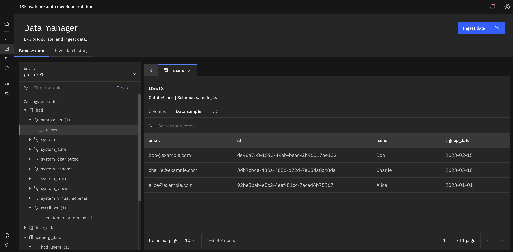

# Converged workloads with IBM watsonx.data and Datastax HCD

## 1. Overview

**Purpose:**  
Facilitate seamless integration of DataStax HCD (Cassandra) to manage extensive operational workloads, using wx.d for enhanced governed analytics capabilities.


**Scope:**  
Covers installation of watsonx.data and HCD, and the use of Spark to synchronize real-time data with an Iceberg table.

**Audience:**  
Targeted towards Developers, Customer Engineers, and Pre-sales professionals.

## 2. Prerequisites

System Requirements:
- Architecture: x86_64 or ARM64
- Cores: Minimum 12
- Memory: Minimum 16GB RAM
- Disk Space: Minimum 100GB free space

Supported platforms:
- macOS (Intel or Apple Silicon)
- Windows 10/11 64-bit

## 3. Installation Steps

### A. Start IBM watsonx.data Developer Edition

Follow the [IBM watsonx.data Developer Edition installation steps](https://www.ibm.com/docs/en/watsonxdata/standard/2.2.x?topic=developer-edition-new-version). It will take a while before everything is configured and installed, please be patient.

Finally expose the IBM watsonx.data Developer Edition UI:
```bash
export KUBECONFIG=~/.kube/config && nohup kubectl port-forward -n wxd service/lhconsole-ui-svc 6443:443 --address 0.0.0.0 > /dev/null 2>&1 &
```

Test IBM watsonx.data Developer Edition by navigating to [https://localhost:6443/](https://localhost:6443/) and logging in with `ibmhladmin` / `password`.


In case you want access to MinIO and MDS:
```bash
export KUBECONFIG=~/.kube/config && nohup kubectl port-forward -n wxd service/ibm-lh-minio-svc 9001:9001 --address 0.0.0.0 > /dev/null 2>&1 &
export KUBECONFIG=~/.kube/config && nohup kubectl port-forward -n wxd service/ibm-lh-mds-thrift-svc 8381:8381 --address 0.0.0.0 > /dev/null 2>&1 &
```
See the [IBM watsonx.data documentation](https://www.ibm.com/docs/en/watsonxdata/standard/2.2.x?topic=administering-exposing-minio-service) for more information.

Navigate to [http://localhost:9001/](http://localhost:9001/) and use username / password for MinIO: dummyvalue / dummyvalue.


### B. Start DataStax Hyper-Converged Database

Download the [tarball](http://downloads.datastax.com/hcd/hcd-1.2.3-bin.tar.gz) and unzip.

When using with Java 17, please set `CASSANDRA_JDK_UNSUPPORTED=true`.
Start with:
```bash
export JAVA_HOME="$(/usr/libexec/java_home -v17)"
export PATH="$JAVA_HOME/bin:$PATH"
export CASSANDRA_JDK_UNSUPPORTED=true
./bin/hcd cassandra
```

Look for:
> INFO  [main] 2025-10-27 13:40:24,500 HcdDaemon.java:22 - HCD startup complete

Test if all works well:
```bash
bin/hcd cqlsh -u cassandra -p cassandra
```

You should be able to log in. Type `quit` to exit.

Load some sample data:
```bash
cqlsh -f sample-data.cql
```

### C. Add HCD to watsonx.data
1. Navigate to [https://localhost:6443/#/infrastructure-manager](https://localhost:6443/#/infrastructure-manager) and click `Add component'
2. Select `Cassandra` as a data source, click `Next`. Use the following configuraton details:
    - Display name: HCD
    - Hostname: host.containers.internal
    - Portname: 9042
    - Username: cassandra
    - Password: cassandra
    - Select 'Associate catalog'
    - Catalog name: hcd

Test to see if the sample data is available:
1. Click the `hcd` catalog
2. Click `Data Objects`
3. Expand `sample_ks` and click `users` in the Catalog browser
4. Click `Data sample` and confirm the 3 users are present



## Federated analytics
The first converged data integration is based on federated analytics using Presto as a query engine.

1. First associate the `hcd` catalog with Presto by clicking `Presto`
    - Click `Manage associations`
    - Add `hcd`, then `Save and restart engine`

2. Now you can start querying your operational data in the analytical environment of watsonx.data:
    - Open `Query workspace` on the left hand side
    - Ensure `Presto` is selected as the active engine
    - Run the following query `SELECT * from hcd.sample_ks.users`


Done! You have just queried Cassandra using SQL through the Presto Query Engine!

## Materialized analytics using wx.d CTAS
Federated analytics can be stressful on an operational system that handle massive workloads and requires low latencies. Hence it can be helpful to materialize the data into a governed catalog with associated Parquet files. This concept is called *Data Offloading* within watsonx.data.

With fit-for-purpose engines, data warehousing costs can be reduced by offloading workloads from a data warehouse to watsonx.data. Specifically,
applications that need to access this data can query it through Presto (or Spark). This includes being able to combine the offloaded data with the data that remains in the warehouse.

1. First create a new schema in Iceberg
    - Click `Data manager`, `Create` and then `Create schema`, select:
        - Catalog: iceberg_data
        - Name: hcd_users

2. Now transfer the data from the operational database to the analytical Iceberg table
    - Click `Query workspace` and click `+` to create a new query tab
    - Use the following CTAS (Create Table As) query
        ```sql
        create table iceberg_data.hcd_users.users as
        select * from hcd.sample_ks.users;
        ```
        

3. Test it all works!
    - Click `Query workspace` and click `+` to create a new query tab
    - Run the following query on the analytical catalog:
        ```
        select * from iceberg_data.hcd_users.users
        ```

        

# Utilizing the Spark engine on Materialized analytics
A lot of DataStax DSE customers have a use-case for Spark on top of their operational data and have been using DSE Analytics as a Spark engine. Now with watsonx.data the synergy between operational and analytical processing can be provided easily when using  Hyper-Converged Database (HCD) as well.

1. First create a new Spark engine
    - Click `Infrastructure manager` select `IBM Spark` and click `Next`
        - Display name: Spark
        - Associated catalogs: iceberg_data
    - Click `Create`

THIS SECTION NEEDS TO BE FINISHED

## References used throughout
- https://www.ibm.com/docs/en/watsonxdata/standard/2.2.x?topic=developer-edition-new-version
- https://github.ibm.com/Data-Labs/wx.d-developers-edition-add-hcd
- https://github.ibm.com/pravin-bhat/cass_spark_iceberg
